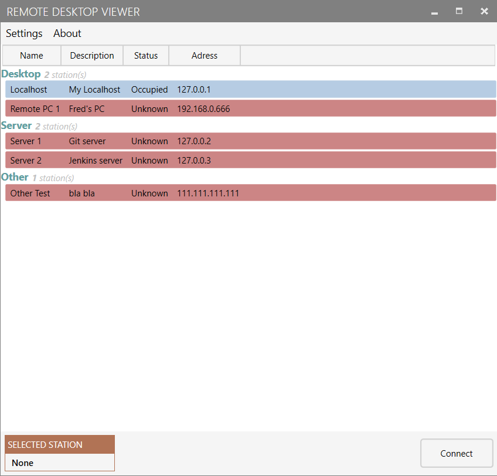

# Remote Desktop Viewer
Creator: `Erik Rodriguez`

Date published: `2020-06-16`

## What is it?
Remote Desktop Viewer is an open-source program which allows the user to maintain multiple RDP (Remote Desktop Protocol) connections. The program uses the Windows integrated application `Remote Desktop Connection` to maintain a connection between two desktops.

The application is built with WPF and the .NET Framework 4.7.2 for Windows Applications.

Two built-in client softwares are used as the base of this program.

### Mstsc.exe
mstsc.exe is the built-in client software which allows connecting to a computer via Remote Desktop Protocol (RDP). It is a special network protocol which allows a user to establish a connection between two computers and access the Desktop of a remote host. 

More info about it can be found [here](https://winaero.com/blog/mstsc-exe-command-line-arguments/#:~:text=Remote%20Desktop%20(mstsc.exe)%20Command%20Line%20Arguments,Desktop%20of%20a%20remote%20host.).

### Qusuer
Quser (query user) is a built-in Windows command line tool that is particularly useful when needing to identify active user sessions on a computer.  This feature exists in regular Windows versions as well as Windows Server.

More info about it can be found [here](https://qtechbabble.wordpress.com/2017/04/07/use-quser-to-view-which-accounts-are-logged-inremoted-in-to-a-computer/).

## Why use it?
This program makes it a lot easier to keep track of and manage multiple connections. The user can easily create new connections and manage or remove existing ones. The program also allows for exporting and importing an xml of these connections, which helps if the program is used on multiple computers.

- Name
  - Specifies a name for the connection.
- Description
  - Describes the connection
- Status
  - Indicates if the connection is available, occupied or if its state is unknown.
- Adress
  - refers to the connections ip-address. This could be a local or a remote address (as long ass you have access to it).

## How to use it?
If you do not wish to perform any changes of your own, simple download the RDVInstaller.msi file and run it to install the application.

Once started, you can manage your list of connections by going to Settings/Station Settings.

If you wish to use the same connection list between multiple desktops, you can easily export and import the list as an xml-file by going to Settings/Database -> export/import.

Double-click on a connection to attempt to connect to it. You can also right-click a selected station for additional functions, such as:
### Edit
this allows you to quick-edit the details of the selected connection.

### Join Sessions
This option is only available if the connection is currently occupied. A request will be sent to active user asking if you may join the connection, allowing both of you to be connected at the same time (you as a session guest).

### Take Over
This option is also only available if the connection is currently occupied. This throws out the current user and allows you to take over the session.

## Other 

The icon used for the program was created by **Smashicons** and can be found [here](https://www.flaticon.com/free-icon/screens_2489379).

___
Erik Rodriguez, 2020

